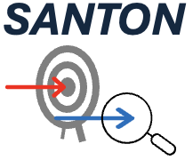

# SANTON (Sequencing Analysis Toolkits for Off-target Nomination)

##### Author: Huan Qiu, Ruijia Wang
##### Date: 2024-12-20
##### Version: 0.0.1

<p align="center">
  
</p>


## About SANTON

**SANTON** is a bioinformatics package for identification and quantification of potential off-target sites using NGS data derived from off-target nomination and screening sequencing methods. This version includes SOS (synthetic oligonucleotide-based sequencing) and WGS (whole genome-base sequencing) modules.


## Table of Contents

- [Installation](#installation)
- [Tutorials and documentation](#tutorials-and-documentation)
- [License](#license)


## Installation
To install the package, use the following steps:

1. **Download bedtools:**
Follow instruction to download and/or install bedtools executables
https://bedtools.readthedocs.io/en/latest/content/installation.html

2. **Clone the SANTON repository:**

    ```bash
    git clone https://github.com/VOR-Quantitative-Biology/SANTON.git
    ```

3. **Navigate to the SANTON project directory:**

    ```bash
    cd santon
    ```
	
	
4. **Install dependencies**

    ```bash
    pip install -r requirements.txt
    ```

Alternatively, you can build docker environment following steps below to avoid installing dependencies in your computing environment:
```
cd santon
docker build -t santon:v0.0.1 .
```


## Tutorials and documentation

Tutorials and documentation for [SOS module](./tutorials/sos-tutorial.md)

Tutorials and documentation for [WGS module](./tutorials/wgs-tutorials.md)


## License

- The use of **SANTON** is governed by a custom license permitting **non-commercial use only** [LICENSE](./LICENSE). This package is freely available to individuals, universities, non-profit organizations, educational institutions, and government entities for non-commercial research or journalistic purposes.

- By cloning or downloading this repository, the user acknowledge that the user has **read, understood, and agree** to abide by the terms outlined in the [LICENSE](./LICENSE) file.


