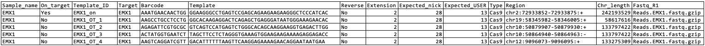
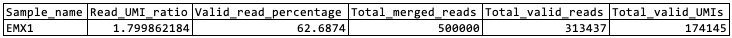
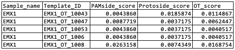
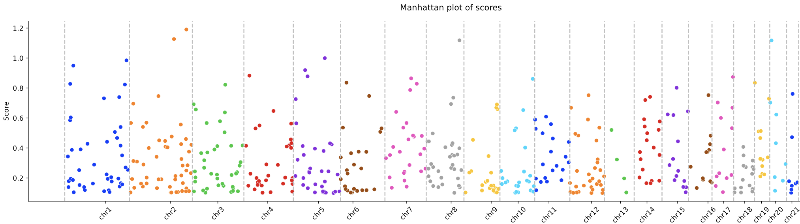
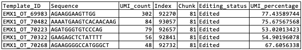
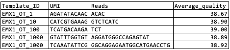
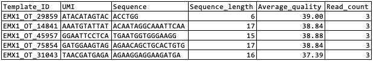

# SOS.py tutorial and documentation

## Usage of SOS.py
Execute the following command
```
python SANTON/SOS.py -h 
```
It'll bring up the usage information
```
usage: SOS.py [-h] [-a ANALYSIS_FILE] [-i INPUT_FOLDER] [-o OUTPUT_FOLDER] [-n PROCESSOR_NUMBER]

Analysis merged NGS reads produced from oligonucleotide-based sequencing.

options:
  -h, --help            show this help message and exit
  -a ANALYSIS_FILE, --analysis_file ANALYSIS_FILE
                        Required, define local path to an analysis file
  -i INPUT_FOLDER, --input_folder INPUT_FOLDER
                        Required, define local path to a folder containing input fastQ files
  -o OUTPUT_FOLDER, --output_folder OUTPUT_FOLDER
                        Optional, define local path to a folder holding output files. Default is current directory
  -n PROCESSOR_NUMBER, --processor_number PROCESSOR_NUMBER
                        Optional, number of processor to be used for parallel computing
  -s SCORE_CUTOFF, --score_cutoff SCORE_CUTOFF
                        Optional, mininal score for an off-target region to be included in manhattan plot
```


## Test run with example dataset
A test run can be executed using exmpale fie and dataset that come with this package.
```
python SANTON/SOS.py -n 3 \
-a SANTON/exampleFiles/sos/inputFiles/AnalysisFile.EMX1.tsv \
-i SANTON/exampleFiles/sos/inputFiles/ \
-o santon-output
```
This command, once successfully completed, results in a output directory 'santon-output' in the current working directory. Its subfolder 'EMX1' contains all output files from data analysis that are supposed to be identical to those located in /SANTON/exampleFiles/sos/outputFiles/.

## Test run with example dataset using docker image

Build SANTON docker image following insturction for [Installation](../README.md). Then copy SANTON package to current directory
```
ls .
santon
```
Execute below command while mounting current directory to folder /mnt inside of docker (customize `$path-to-current-directory`).
```
docker run --rm --shm-size=2.83gb -v {$path-to-current-directory}:/mnt santon:v0.0.1 SOS.py -n 3 \
-a SANTON/exampleFiles/sos/inputFiles/AnalysisFile.EMX1.tsv \
-i SANTON/exampleFiles/sos/inputFiles/ \
-o santon-output
```
Output folder will be produced in current direcotry.

## Analysis file
The Analysis file (specified using `-a` or `--ANALYSIS_FILE`) is a tab-delimited file that contains dataset annotations and instructions for bioinformatic analysis. It is recommended that users create their Analysis file by modifying the example file provided with this package.



Key columns are explained as below:
- Sample_name: a unique name for each template library. This variable will be used to name the output folder for each sample.

- On_target: specify the on-target template as 'Yes' and off-target as 'No'. Statistics associated with on-target template will be used as reference to calculate OT scores.

- Template_ID: uniquie identifier assigned to each off-target region in the panel

- Target: the on-target gene of gRNA

- Barcode: the unique barcode sequence associated with each on/off-target template

- Template: the reference sequence of on/off-target region (as well as its flanking region) included in library design

- Reverse: 'No' for gudie sequence with PAM located on right, and 'Yes' for guide sequence with PAM located on the left

- Extension: the length of nucleotides (bp) to be removed in extended trimming step at the end of reads

- Expected_nick: the expected nick cleavage position in on-target nucleotide template

- Expected_USER: the expected position of nucleotid conversion catalyzed by USER enzyme in on-target nucleotide template. This column is required if the cleavage is mediated by CBE.

- Type: editor used in the cleavage experiment. Supported enzyme including 'Cas9', 'ABE', 'CBE', and 'Cpf1'

- Region: genome coordinate of each on/off-target region

- Chr_length: the length of chromosome where the template resides. This column is optional and is helpful for precise visualization of OT scores along choromosomes.

- Fastq_R1: the name of fastQ file resutled from NGS sequening of the off-target library

## Input fastQ files
SOS.py accepts a folder (designated by `-i` or `--INPUT_FOLDER`) that contains one or more fastQ file(s) to analyzed. The reads should be preprocessed including trimming and paired-end merging.

## Output folder
The output folder is specified using the `-o` or `--OUTPUT_FOLDER` argument. By default, it is set to the current working directory.

## Multi-threading
Number of processors (default = 1) to be used for multi-threading can be specified with `-n` or `--PROCESSOR_NUMBER` argument.

## Score cutoff
The minimal score (default = 0.1) for a template to be included in manhattan plot can be specified using `-s` or `--score_cutoff` argument.

## Output files
Within the output folder, a subfolder will be created for each sample being analyzed, named according to the sample_name variable specified in the Analysis file. Each sample-specific subfolder contains the following files:

### .summary.txt
This table summarizes basic statistics for each sample or library.



- Sample_name: unique name representing an on/off-target template library. Its value is derived from Analysis file defined by the same variable

- Read_UMI_ratio: average number of reads per UMI.

- Valid_reads_percentage: percentage of valid reads

- Total_merged reads: total number of reads with sucessful pair-end merge

- Total_valid_reads: total number of valid reads

- Total_valid_UMIs: total number of valid UMI

### .OT_Score.txt
This table summarizes scores for each on/off-target region from each sample or library. Each row represents a uniqe on/off-target template.



- Sample_name: unique name representing an on/off-target template library. Its value is derived from Analysis file defined by the same variable

- Template_ID: uniquie identifier assigned to each off-target region in the panel. It's the same as in Analysis file

- PAMSide_score: PAM-side score for each on/off-target template

- ProtoSide_score: Proto-side score for each on/off-target template

- OT_score: the on/off-target score for each template

### .OT_Score.pdf
This manhattan plot includes templates with score greater specified cutoff. Each dot stands for a template with their relative location in a chromosome indicated by its x-axis. The y-axis indicates score for each template.


### .allele.PAMSide.UMI_unique.UMIcount.txt
This table provides a summary of the observed sequences and annotations for each on/off-target template. Each row represents a uniqe on/off-target fragment for a specific template.



- Template_ID: uniquie identifier assigned to each off-target region in the panel. the same as in Analysis file

- Sequence: partial sequence of on/off-target template sequence on the PAM side (truncated on the proto-side)

- UMI_Count: number of UMIs associated with this template

- Index: index number associated with this template

- Chunk: trunck identifier associated with this tempalte during paralell computing

- Editing_status: whether the template is considered edited UMI

- UMI_percentage: faction of total UMI counts accounted for by this template

The interpretation of .allele.ProtoSide.UMI_unique.UMIcount.txt is simailar. 

### .UMI_Reads.PAMSide.raw.txt
This table summarizes the reads associated with each on/off-target region, along with the UMIs carried by each read. Each row represents a unique NGS read for a specific template.



- Template_ID: uniquie identifier assigned to each off-target region in the panel. the same as in Analysis file

- UMI: UMI associated with this read sequence

- Reads: observed partial on/off-target sequence resulted from cleavage

- Average_quality: average sequence quality of the read

The interpretation of .UMI_Reads.ProtoSide.raw.txt is simailar. 

### .UMI_Reads.PAMSide.UMI_unique.Readscount.txt
This table summarizes the UMIs associated with each on/off-target region. Each row represents a unique UMI for a specific template.



- Template_ID: uniquie identifier assigned to each off-target region in the panel. the same as in Analysis file

- UMI: sequence of the UMI

- Sequence: representative  on/off-target sequence after UMI consolidation

- Sequence_length: length of the representative sequence

- Average_quality: average sequence quality of the representative sequence

- Read_count: total number of reads carrying this UMI

The interpretation of .UMI_Reads.ProtoSide.UMI_unique.Readscount.txt is simailar.