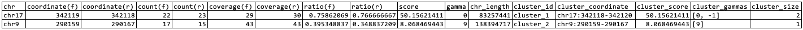

# WGS.py tutorial and documentation


## Usage of WGS.py

Execute WGS.py script with '-h' flag
```
python SANTON/WGS.py -h
```
It'll bring up the usage information
```
usage: WGS.py [-h] [-be BAM_FILE_EDITED] [-q CUTOFF_MAPPING_QUALITY] [-f CUTOFF_SUPPORTING_READS_FORWARD] [-r CUTOFF_SUPPORTING_READS_REVERSE] [-d CUTOFF_COVERAGE] [-R CUTOFF_RATIO] [-G GAMMA] [-s CUTOFF_SCORE] [-e ENZYME] [-g REFERENCE_GENOME] [-grna GUIDE_RNA] [-pam PAM_LOCATION] [-n PROCESSOR_NUMBER] [-o OUTPUT_FILE]
                   [-bc BAM_FILE_CONTROL]

This is a tool to analyzed off-target nomination NGS data derived from samples treated by enzyme such as Cas9, Cpf1 and ABE/CBE.

options:
  -h, --help            show this help message and exit
  -be BAM_FILE_EDITED, --bam_file_edited BAM_FILE_EDITED
                        : a bam file derived from edited sample
  -q CUTOFF_MAPPING_QUALITY, --cutoff_mapping_quality CUTOFF_MAPPING_QUALITY
                        : minimal mapping quality for a read to be considered in analysis
  -f CUTOFF_SUPPORTING_READS_FORWARD, --cutoff_supporting_reads_forward CUTOFF_SUPPORTING_READS_FORWARD
                        : minimal count of supporting reads aligned forwardly to reference
  -r CUTOFF_SUPPORTING_READS_REVERSE, --cutoff_supporting_reads_reverse CUTOFF_SUPPORTING_READS_REVERSE
                        : minimal count of supporting reads aligned reverse-complementarily to reference
  -d CUTOFF_COVERAGE, --cutoff_coverage CUTOFF_COVERAGE
                        : minimal count of reads that mapped to a position in reference regardless of mapping orientation
  -R CUTOFF_RATIO, --cutoff_ratio CUTOFF_RATIO
                        : minimal fraction of reads supporting edit at a position in reference
  -G GAMMA, --gamma GAMMA
                        : number of base pair between edit: 0 for blunt-end cut; >0 for 5'overhang cut; <0 for 3'overhang
  -s CUTOFF_SCORE, --cutoff_score CUTOFF_SCORE
                        : minimal score for a cut site to be included in final report
  -e ENZYME, --enzyme ENZYME
                        : enzyme used genome editing. Supported options include 'Cas9', 'ABE', 'CBE', and 'Cpf1'.
  -g REFERENCE_GENOME, --reference_genome REFERENCE_GENOME
                        : path to reference genome (optional)
  -grna GUIDE_RNA, --guide_rna GUIDE_RNA
                        : guide RNA sequence including spacer and PAM (optional)
  -pam PAM_LOCATION, --pam_location PAM_LOCATION
                        : location of pam relative to spacer, either 'left' or 'right' (optional)
  -n PROCESSOR_NUMBER, --processor_number PROCESSOR_NUMBER
                        : number of processor to be used for parallel computing (optional)
  -o OUTPUT_FILE, --output_file OUTPUT_FILE
                        : path to a *.csv output file (optional)
  -bc BAM_FILE_CONTROL, --bam_file_control BAM_FILE_CONTROL
                        : a bam file derived from control sample
```

## Test run with example dataset

### Basic run in Cpf1 mode
```
python SANTON/WGS.py -f 5 -r 5 -s 2.5 -e Cpf1 \
-be SANTON/exampleFiles/wgs/inputFiles/santon-wgs.bam \
-o  wgs-cleavages.Cpf1.csv
```
This command generates the specified output file (wgs-cleavages.Cpf1.raw_predictions.csv) including all predicted cleavage sites. In addtion, an Excel table of the same file name (wgs-cleavages.Cpf1.raw_predictions.xlsx) is also generated. This Excel file has the same content as in the .csv file and provides convinience for manual inspection of the data.


and a second set of files with only one site per cluster (e.g., wgs-cleavages.Cpf1.csv and .xlsx). For each cluster, the site with the highest score is selected as representative site.



- chr: chromosome that contains the predicted cleavage

- coordinate(f): genomic position of 5'-alignment of forwardly-mapped read cluster

- coordinate(r): genomic position of 5'-alignment of reversely-mapped read cluster

- cout(f): read count in the forwardly-mapped read cluster

- cout(r): read count in the reversely-mapped read cluster

- coverage(f): read count in the forwardly-mapped read cluster

- coverage(r): read count in the reversely-mapped read cluster

- ratio(f): supporting ratio in the forwardly-mapped read cluster

- ratio(r): supporting ratio in the reversely-mapped read cluster

- score: score of the cleavage site

- gamma: relavtive distance between the genomic position of 5'-alignment of forwardly-mapped read cluster and reversely-mapped read cluster

- chr_length: size of the chromosome that contains the identified cleavage site

- cluster_id: unique ID number for each cluster

- cluster_coordinate: the coordinate of the genomic region encompassing all cleavage sites in the cluster

- cluster_score: the highest cleavage in the cluster

- cluster_gammas: gammas values included in each cluster

- cluster_size: number of cleavage sites included in a cluster

For each table, a Manhattan plot is generated by default, with chromosome sizes and the locations of predicted cleavage sites shown in proportional representation. Using 'wgs-cleavages.Cpf1.raw_predictions.pdf' as an example, predicted cleavage sites that are located at the beginning of chromosomes are marked with arrows, as illustrated below.


### Example run in Cpf1 mode with alignment annotation features
When 3 more argument values are provided (-grna, -pam, -g), alignment will be generated between gRNA and off-target region sequence.
```
python SANTON/WGS.py -f 5 -r 5 -s 2.5 -e Cpf1 \
-be SANTON/exampleFiles/wgs/inputFiles/santon-wgs.bam \
-grna TTTNCTGATGGTCCATGTCTGTTA -pam left \
-g SANTON/exampleFiles/wgs/inputFiles/hg38-mini.fna \
-o wgs-cleavages.Cpf1.with-alignment.csv
```
This command generates tables with additional annotation columns as below:


- alignment: alignment between off-target reference sequence (above) and input gRNA sequence (bottom).

- mm+gap: number of mismatches and gaps in the alignment

- gRNA_strand: orientation of off-target region sequence relative to gRNA


### Example run in ABE mode with alignment annotation features
```
python SANTON/WGS.py -f 5 -r 5 -s 2.5 -e ABE \
-be SANTON/exampleFiles/wgs/inputFiles/santon-wgs.bam \
-grna GAACACAAAGCATAGACTGCNRG -pam right \
-g SANTON/exampleFiles/wgs/inputFiles/hg38-mini.fna \
-o  wgs-cleavages.ABE.with-alignment.csv
```
This command generates tables with annotation columns specific to base editors (ABE and CBE).


- edit_window: the reference sequence of the 5-bp region flanking cleavage position on the protoside. The sequence is shown as forward strand.

- with_editable nucleotide: the value is True if edit_window contains 'A' for ABE and contains 'C' for CBE.

### Example run using customized gamma value(s)
Search cleavage sites with a single gamma value
```
python SANTON/WGS.py -f 5 -r 5 -s 2.5 -G 11 \
-be SANTON/exampleFiles/wgs/inputFiles/santon-wgs.bam \
-o  wgs-cleavages.G11.csv
```
This command returns clevage sites with gamma=11 alignment pattern.


Search cleavages with more than one gamma values
```
python SANTON/WGS.py -f 5 -r 5 -s 2.5 -G '[0,11]' \
-be SANTON/exampleFiles/wgs/inputFiles/santon-wgs.bam \
-o  wgs-cleavages.G0-11.csv
```
This command returns clevages with gamma=0 or gamma=11 alignment patterns.


### Example run using with control bam file
When a control bam file is provided, all cleavage sites identified in it will be considered background. Candidate cleavage sites overlap with background will be removed from final resutl.
```
python SANTON/WGS.py -f 5 -r 5 -s 2.5 -e Cpf1 \
-be SANTON/exampleFiles/wgs/inputFiles/santon-wgs.bam \
-bc SANTON/exampleFiles/wgs/inputFiles/santon-wgs-control.bam \
-grna TTTNCTGATGGTCCATGTCTGTTA -pam left \
-g SANTON/exampleFiles/wgs/inputFiles/hg38-mini.fna \
-o wgs-cleavages.Cpf1.filtered.csv
```
This command generate a table for background (.control.csv), a table for filtered cleavage sites (.filtered.raw_predictions.csv), and a table for filtered cleavage sites after removing redundancy at cluster level (*.filtered.csv).

## Test run with example dataset using docker image

Build SANTON docker image following insturction for [Installation](../README.md). Then copy SANTON package to current directory
```
ls .
santon
```
Execute below command for a Cpf1-mode analysis while mounting current directory to folder /mnt inside of docker (customize `$path-to-current-directory`).
```
docker run --rm --shm-size=2.83gb -v {path-to-current-directory}:/mnt santon:v0.0.1 WGS.py \
-f 5 -r 5 -s 2.5 -e Cpf1 \
-be SANTON/exampleFiles/wgs/inputFiles/santon-wgs.bam \
-o  wgs-cleavages.Cpf1.csv
```
Output files will be produced in current direcotry. Change inputs to WGS.py accordingly to test other example analyses.


## Usage documentations

#### Supporting read count cutoff
Specify the minimal number of reads to support a potential cut site when it come to forwardly aligned read (`-f` or `--cutoff_supporting_reads_forward`) or reversely aligned reads (`-r` or `--cutoff_supporting_reads_reverse`).

#### Coverage cutoff ####
Specify coverage (or sequence depth) at a position (`-d` or `--cutoff_coverage`) to remove poorly sequenced positon or region from being further considered.

#### Mapping quality cutoff ####
Specify minimal mapping quality of reads (`-q` or `--cutoff_mapping_quality)` to remove unreliably aligned reads from supporting read count and coverage assessment.

#### Supporting ratio cutoff ####
Specify the minial ratio of supporting read (`-R` or `--cutoff_ratio`) for a potential cut site to be reported. the ratio is calculated as supporting read count be devided by read coverage at the same position.

#### Score cutoff ####
Specify the minial score (`-s` or `--cutoff_score`) for a potential cut site to be reported.

#### Gamma ####
Define the length of overlapping base pair between forwardly and reversely aligned reads (`-G` or `--gamma`). The value can be an integer (eg, 0, 1 or 2), a list of integers (eg, [0,1,2]) in code, or a string encoding a list integers (eg, '[0,1,2]').

Typicaly, the gamma (0) stands for blunt-end cleavage caused by Cas9 cleavage, gamma (>0) for overlap between forward and reverse read clusters and gamma (<0) for gap between forward and reverse read clusters.

#### Pre-defined analysis mode ####
Four enzyme (`-e` or `--enzyme`) options are available at the moment including Cpf1, ABE, CBE and Cas9 each defined an analysis mode. When enzyme is specified as Cpf1, cleavages corresponding to -10~10 gamma values will be reported. Specify enzyme to ABE or CBE, all potential cleavages corresponding to 1~19 gamma values will be reported. For Cas9, cleavages with 0bp read overlapping (blunt-end) will be reported. 

In cases of Cpf1, ABE, and CBE, cleavage sites in ≤5bp away are grouped into cluster. For each cluster, a representative site is selected as the one with the highest score.

In cases of ABE and CBE, genomic sequences flanking to cleavage site on the proto-side are reported for examination of existance of editable nucleotides (A for ABE and C for CBE).

#### Input BAM file ####
Specify BAM file to be analyzed. This input file has to come with an index file with suffix '.bai'.

#### Multithreading ####
Specify number of processors to be used for computing (`-n` or `--processor_number`) to spead up process. When not specified, N-1 process will be used by default (N stands for availabe processor number in the computing environment).

### Edit site annotation ###

#### Generate alignment between gRNA and potential off-target ####
Specify gRNA (`-grna` or `--guide_rna`) and path to reference genome in fastA format (-g or --reference_genome), aligment between sequences of gRNA and identified off-target region as well as difference between algined region (mismatch and gap) and orientation of gRNA relative to reference will be reported.


#### Sequence flanking edited site ####
Specify PAM location (`-pam` or `--pam_location`), gRNA sequence flanking edit on the PAM site will be reported. This information is useful to examine the distance between edit and PAM. When enzyme is 'ABE' or 'CBE', flanking reference (genomic) sequence at protoside will be reported to reveal presence of editable base, e.g., 'A/T' for ABE and 'C/G' for CBE.

### Edit site filtering ###

#### Filter edit site found in control sample ####
Specify BAM file derived from control experiment (`-bc` or `--bam_file_control`), edits identified from this BAM file will be used to intersect with those from BAM file from edited sample. Shared edits will be removed from final report. This input file has to come with an index file '.bai'.

